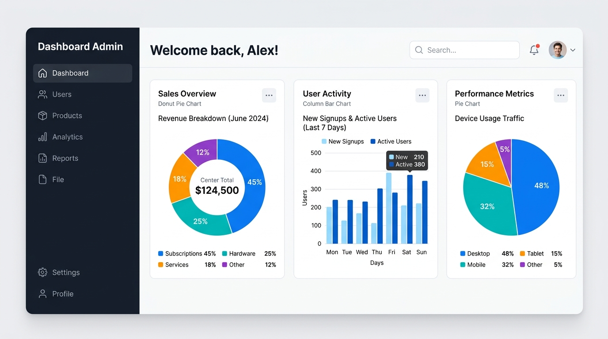

# Secure Web Administrative Dashboard 🛡️

A robust, full-stack administrative dashboard built with **Next.js** on the frontend and **Flask** on the backend. This project provides a secure, Role-Based Access Control (RBAC) environment for managing e-commerce data such as products, orders, and users.



## 🌟 Key Features

- **Role-Based Access Control (RBAC)**: Only authorized `admin` users can access the dashboard. Unauthenticated or non-admin users are automatically redirected.
- **JWT Authentication**: Secure API communication with token-based authentication.
- **Interactive Visualizations**: Beautiful, real-time analytics charts using **Recharts**.
  - 📦 Products by Category (Pie Chart)
  - 🛒 Orders Overview by Status (Bar Chart)
  - 👥 User Roles Distribution (Pie Chart)
- **Modern UI Components**: Built with Tailwind CSS and Radix UI primitives for a sleek, responsive design.

## 🚀 Tech Stack

- **Frontend**: Next.js 14, React, Tailwind CSS, Recharts, Lucide Icons.
- **Backend**: Flask, SQLite3, PyJWT, bcrypt.

## ⚙️ Getting Started

### Prerequisites
- Node.js (v18+)
- Python 3.8+

### Installation

1. **Clone the repository**
   ```bash
   git clone https://github.com/SoufianeMajd/secure-admin-dashboard.git
   cd secure-admin-dashboard
   ```

2. **Install frontend dependencies**
   ```bash
   npm install
   ```

3. **Set up environment variables**
   Copy the example environment file and configure it if necessary (it defaults to `http://localhost:5000` for the backend):
   ```bash
   cp .env.example .env.local
   ```

4. **Start the frontend development server**
   ```bash
   npm run dev
   ```
   *The dashboard will be available at `http://localhost:3000`.*

### Backend Setup (Requires the `PROJECT` directory)
1. Navigate to your backend directory.
2. Install Python dependencies:
   ```bash
   pip install flask flask-cors bcrypt PyJWT requests beautifulsoup4
   ```
3. Start the Flask server:
   ```bash
   python main.py
   ```
   *The API will be available at `http://localhost:5000`.*

## 🔒 Security Measures

This project implements multiple layers of security:
- **Frontend Security**: The `useAuth` hook validates the user's session and type on every protected route. If the API returns a `401 Unauthorized` (e.g., expired token), the user is securely logged out.
- **Backend Security**: All sensitive endpoints (e.g., `/api/products`, `/api/orders`) are protected by a `@token_required` decorator that validates the JWT.
- **Database Security**: All SQL queries use parameterized statements to prevent SQL Injection attacks.

## 📄 License

This project is licensed under the MIT License.
